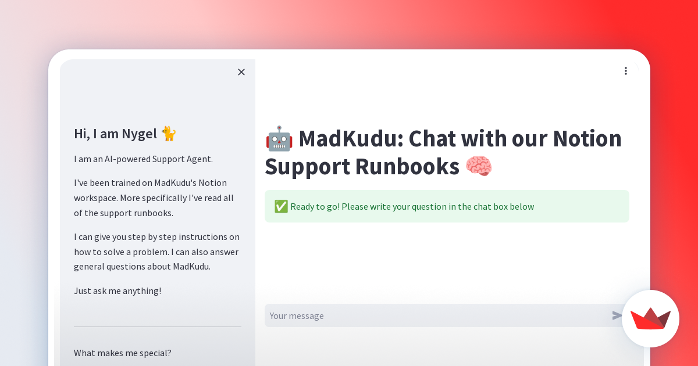

# notion_QA

Build a chatbot trained on your Notion Workspace data and host it via Streamlit


# Available in Streamlit for testing

[Internal MadKudu Version](https://mk-support-runbook.streamlit.app/)

# Download your Notion Workspace data

1. Go to your Notion Workspace
2. Click on Settings & Members
3. Click on Settings
4. Click on Export Content
5. Click on Export
6. Wait for the email from Notion
7. Download the zip file
8. Unzip the file
9. Rename the folder to "notion_data"

NB: you may also download the data from one sub page of your Notion Workspace to try things out

# Technical setup

## Create a virtual environment

```
python3 -m venv venv
source venv/bin/activate
```

## Install the requirements

```bash
pip install -r requirements.txt
```

Should you want to upgrade the requirements, you can run the following command:

```bash
pip install --upgrade --force-reinstall -r requirements.txt
```

## Run embeddings for a Notion workspace

Note: this will take a while as it drops and creates your vector database

```bash
python ./notion/embed_notion.py --n support_runbook
```

## Run the chatbot with streamlit

```bash
streamlit run ./notion/support.py
```

## Add more documents from Notion to your vector database

if you want to add more documents from a Notion export to your vector database, you can run the following command

```bash
python ./notion/embed_notion.py --n product_operations --insert
python ./notion/embed_notion.py --n playbooks_faq --insert
```

### Add more documents from Zendesk to your vector database

if you want to add more documents from a Zendesk export to your vector database, you can run the following command

```bash
python ./notion/embed_zendesk.py --z product_operations --insert --zendesk
```
